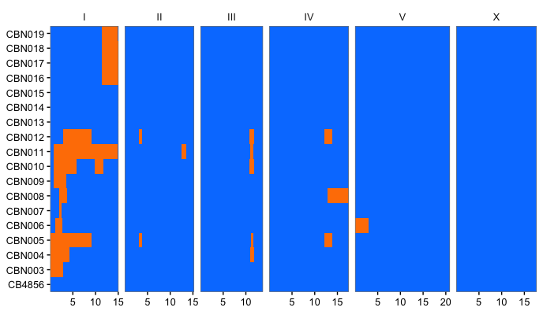

# Overview

```
vk hmm [options] --alt=<alt_sample> <vcf>
```

The `vk hmm` uses a hidden-markov-model to call near-isogenic lines (NILs) or recombinant-inbred lines (RILs). The `hmm` command is designed for use with low-coverage sequence data from RIL or NIL populations and is designed for its ease of use in these cases. However, it is not designed to replace alternatives such as  such as [Impute2](https://mathgen.stats.ox.ac.uk/impute/impute_v2.html) or [Beagle](http://faculty.washington.edu/browning/beagle/b3.html) which can be used in many additional types of analysis.

* `--alt=<alt_sample>` - The name of the alternative sample.

To use the `vk hmm` command, you'll need a VCF with these requirements:

1. The 'alternative' (non-reference) parent must be included in the VCF.
1. One of the parents must be the reference, but it is not necessary that it be included in the VCF.

We have had success using the `vk hmm` command whole genome sequencing strains of _C. elegans_ at very low depth (~1.5x). Genotyping arrays can also be used.

The `vk hmm` command iterates through the VCF, assembles an array of genotypes found to be alternative in the non-reference parent, and uses an hmm to assign parental haplotypes.

# Options

* `--ref=<ref_sample>` - If the reference sample was sequenced, it can be used to filter out sites called alternative in the reference sample. As this is the reference sample, we expect to observe only reference sites. Therefore, these sites are more likely to be erronous due to being located in repetitive regions and the result of low coverage or alignment issues.
* `--vcf-out` - Outputs a VCF, assigning genotypes based on parental haplotypes called by the hmm. A `GT_ORIG` format field is added to retain the original genotype call.
* `--all-sites` - By default, when using --vcf-out only sites where the `alt_sample` == 1/1 are output. This option can be used to output all sites in a VCF.
* `--endfill` - When outputting genomic regions, if a parental genotype is assigned at the very beginning or end of a chromosome use 1 or the length of the chromosome, respectively. The endfill option is recommended for near-isogenic lines, and __not__ for recombinant inbred lines.
* `--infill` - Assume genotypes switch at the end position of the previous block + 1 rather than the next observed genotype. This removes gaps and is useful for aesthetics, but should probably not be used for analysis.
* `--state` - Probability of ref/alt state, accounting for errors. For example, if --state=0.97, the probability the calls are reference is 97% and 3% of calls will be alt (attributable to errors). 
* `--transition` - Probability of transition occuring. We set this very low by default because the state probability accounts for some level of error.


<small>__Effect of using `--infill` and `--endfill` options__ - Orange and blue parental haplotypes can extend to the beginning or end of chromosomes using the `--endfill` option whereas regions between adjacent SNVs where haplotypes switch can be filled in with the next haplotype.</small>

# Recommended Filters

`vcf hmm` can take stdout as input. When working with low-coverage whole-genome sequence data, we recommend applying filters to remove problematic sites. Specficially, the DV/DP ratio can be used to remove problematic alt sites using the command below:

```
bcftools view <vcf> |\
bcftools filter --set-GTs . --exclude '((FMT/DV)/(FMT/DP) < 0.75 && FMT/GT == "1/1")' |\
vk hmm --alt=<alt_sample> --ref=<ref_sample> -
```

# Plotting Results

[This R script](https://gist.github.com/danielecook/c9bf690eddb6ae2b6d4c45f1b93dfd75) can be used to plot. An example is below.


