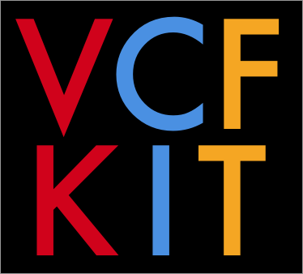

# VCF-kit



## About

The `Variant Call Format Kit` is a collection of tools useful for performing a variety of analyses and operations on variant data stored using the [Variant Call Format](https://en.wikipedia.org/wiki/Variant_Call_Format). VCF-kit is open source and community contributions are encouraged.

VCF-kit is open source and is licensed under [the MIT License](https://raw.githubusercontent.com/AndersenLab/VCF-kit/master/LICENSE). We welcome community contributions.

## Installation

VCF-kit can be installed using `pip`:

```
pip install numpy # You may need to install numpy independently.
pip install VCF-kit
```

__Installing Dependencies:__

```
vk setup
```

`vk setup` uses [homebrew](http://brew.sh/) (or if on linux, [linux-brew](http://linuxbrew.sh/)) to install programs used by VCF-kit:

* bwa
* samtools
* bcftools
* blast
* muscle
